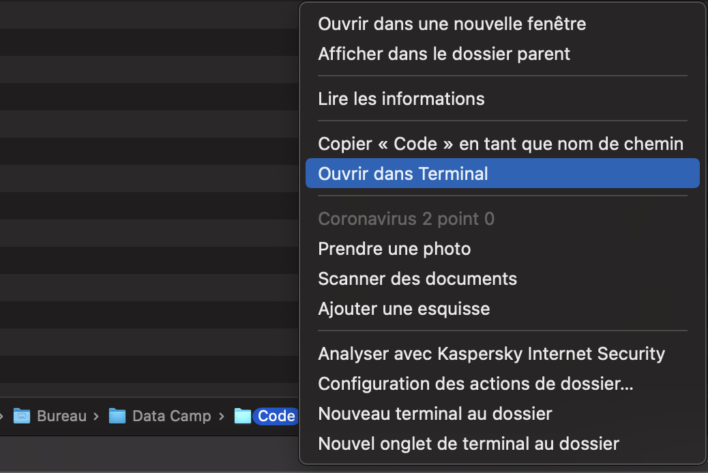
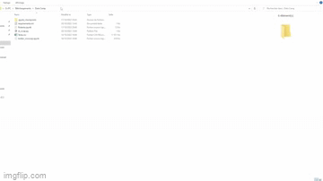

# Scrap_tweet
This is our project to scraping tweet with Tesla.

So how to launch our project ?
You are three ways to do it.
First with Streamlit cloud the link is https://tweeeter.streamlitapp.com/

Second with Azure Portal with the link is https://scraptwittertesladatacamp.azurewebsites.net
and third way is to launch it in local.

## If you are in mac OS you need to follow these step:
First download the zip, then extract the zip in a folder after that you need to right click on the folder and open the terminal like this:

And then after this a windows terminal will appear wait a few seconde and then type "pip install -r requirements.txt" on the terminal, wait 
for this all finished and final thing type "streamlit run st_scrap.py".

## If you are in windows OS you need to follow these step:
First download the zip, then extract the zip in a folder after that you need to go in the search bar and type CMD like this:

And then after this a windows terminal will appear wait a few seconde and then type "pip install -r requirements.txt" on the terminal, wait 
for this all finished and final thing type "streamlit run st_scrap.py".

If you do the right thing technically you will have this screen when you run this

## And what is other files ?

All files with .png is for background or images for the website.

The requirements.txt file is for installing all libraries we need.

The scrap_every_day.py is a file who containe an algorith who every 02AM start and scrap tweet when Tesla is mentionned

Twitter_snsscrap.ipynb is the file for scraping lot of datas

and st_scrap.py and Fonction.py is the main files for the website

# AND DON'T FORGET TO ENJOY !
